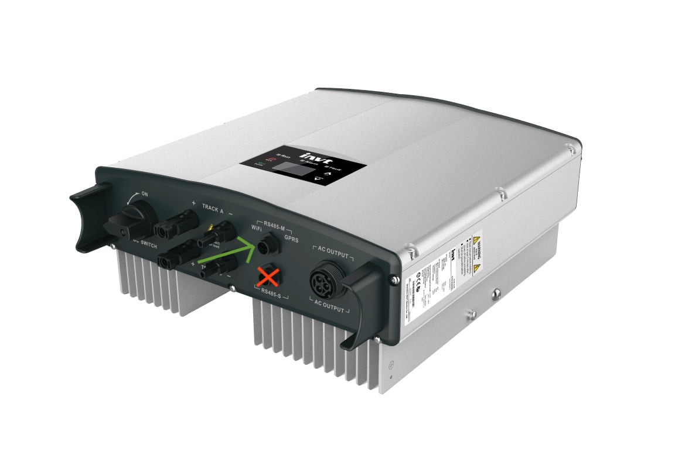

# iMars MG5KTL-2M — ESPHome integration

This repository contains a ready-to-flash ESPHome configuration that lets an ESP8266 board behave like a wired Modbus probe for the **INVT iMars MG5KTL-2M** single-phase solar inverter.  
Once deployed, the node surfaces real-time telemetry (power, energy, voltages, currents, temperatures, status and alarm flags) straight into Home Assistant through the native ESPHome API.

## What you get

* A single YAML file (`imars-mg5ktl-2m.yaml`) with around seventy sensors already mapped.  
* Shield-free wiring: the inverter’s **RS485-M (“WIFI / GPRS”)** port supplies 5 V, ground and the differential pair, so the ESP—together with a tiny 485 breakout—runs from the same connector.  

## Hardware

Any ESP8266 with working GPIO D6 and D7 will do; a **D1 mini** is the smallest hassle.  
Add a 3 V-capable **MAX485 or SN65HVD** transceiver and four dupont leads.

Power arrives through the first two pins; the differential pair carries Modbus RTU at 9600 baud.

**Do not use the RS485-S service port**—its register map appears to be different and is not yet documented.

## Flashing and first boot

1. Install ESPHome (CLI or the Home Assistant add-on).  
2. Copy `imars-mg5ktl-2m.yaml` into your project folder.  
3. Create or edit `secrets.yaml`, adding  
   `wifi_ssid`, `wifi_password`, `esphome_web_username`, `esphome_web_password`, and `esphome_api_encryption_key`.  
4. Run `esphome run imars-mg5ktl-2m.yaml`, select the correct serial port, wait for the first build, and let the node reboot.  
5. After Wi-Fi joins, Home Assistant discovers the device automatically through mDNS.

## Under the hood

All Modbus addresses were recovered by sniffing the inverter’s original Wi-Fi dongle.  
Values flagged **(Alpha)** come from a 16-bit bitmap where bit meanings were inferred from behaviour; some flags might point to the wrong condition.  
Nothing here was endorsed by INVT. Monitoring is read-only, yet an invalid request could in theory upset the firmware, so proceed at your own risk.

Neither the author nor contributors accept liability for damaged hardware, lost generation, or burnt toast.

## Extending the map

If you own a different iMars model, or discover registers that improve accuracy, fork the repo and send a pull request with:

* Register address, size and datatype  
* A short, human-readable name  
* Unit and scaling factor, if known

Raw captures (e.g. Modbus serial logs) are welcome; they help confirm guesses.

## Troubleshooting tips

* If all sensors show `unavailable`, double-check wiring order: A ↔ A, B ↔ B, ground shared.  
* An RS485 bus longer than a few metres benefits from 120 Ω termination at the far end.  
* Setting `logger:` to `DEBUG` reveals every query and reply—useful when adding registers.  
* A cold inverter returns zeros until its DC bus wakes up; this is normal at dawn.

## License

Released under the **MIT License**.